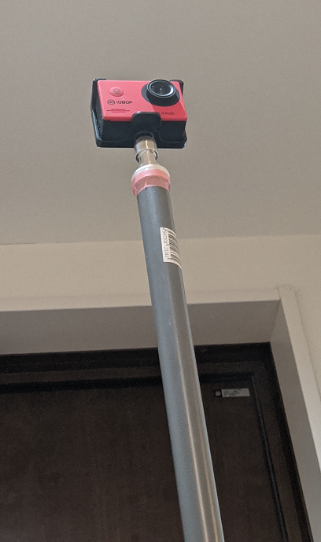

# Sensor tower

This is a sensor tower for IoT:

- Wireless IoT
- AI camera
- GPS
- Sensors

## Features

- AI webcam: integration with OpenCV and TensorFlow Lite
- Intrusion detection
- Auto discovery of web cam's IP address in a LAN segment
- MotionJPEG broadcasting server
- Optional features: low-power wireless, temperature/humidity sensor etc..
- ALPR???

## Tower

The tower consists of a PVC water pipe sitting vertically and platforms on which sensors are mounted:

```

  [AI Webcam]
      | |
      | | [Zigbee (TWELITE) antenna] < - - - - - IEEE802.14.3 - - - - - > [Wearable sensors]
    -------
      | |
      | | [GPS]
    -------
      | |
      | | [Sensors]
    -------
      | |
      | |
      | |
     /   \
    /     \
~~~~~~~~~~~~~~~~

```

=> [Platforms](./blender)

## AI Webcam
 
 
 
### USB video cameras

This project supports any UVC video cameras.

I have got the following cheap cameras supporting UVC:
- https://www.buffalo.jp/product/detail/bsw200mbk.html (FOV 120 degrees horizontal)
- http://www.sac-corp.jp/product/contents/actioncam/ac200.html (FOV 78 degrees horizontal/ 46 degrees vertical)

### Configuration

```
                                OpenCV
                                TensorFlow lite
                                Node.js
[UVC video camera ] --- USB --> [RasPi] --- WiFi --> [HTML5 browser (Chrome on Android or on PC)]
                                        ---      --> [HTML5 browser (Chrome on Android or on PC)]
                                        ---      --> [HTML5 browser (Chrome on Android or on PC)]
```

### Development environments

vi for Node.js, OpenCV and TensorFlow Lite (HTML5, javascript and C/C++ with gcc)

### IP address auto discovery

The web cam advertise IP address and a service ID of its own on UDP port 18084 periodically to the LAN by using ["very simple service discovery protocol"](https://github.com/araobp/service-discovery). An Android app receives the IP packet and launch Chrome browser with the following URL format: 

```
http://<Advertised IP address>:18082/broadcast/<serviceId>
```

Message sequence diagram:
```

  Web cam          Launcher app on Android
     |                      |
     |----- UDP 18084 ----->|
     |                      |
     |----- UDP 18084 ----->|
     |                      |
     |----- UDP 18084 ----->| http://<Advertised IP address>:18082/broadcast/<serviceId>
     |                      |
                            |
                            |
 Motion JPEG broadcaster    |
     |                      |
     |<---- HTTP GET -------|
     |---- Motion JPEG ---->|
     |---- Motion JPEG ---->|
     |---- Motion JPEG ---->|
     |         :            |
     
```

### Code

=> [aicam (C/C++)](./raspi/cpp)

=> [broadcaster.js (javascript/node.js)](./raspi/node/broadcaster.js)

=> [gps.js (javascript/node.js)](./raspi/node/gps.js)

=> [Chrome launcher (Kotlin/Android)](./android)

Sequence diagram
```
Linux host                   broadcaster.js                        Chrome launcher app
    |                             |                                         |
    |--- Advertisment UDP packet ------------------------------------------>| -> URL of AI Webcam
    |              :              |                                         |          |
                                                                                       |
  aicam                      broadcaster.js                              Chrome <------+
    |                             |                                         |
    |                             |<--- HTTP GET /broadcast/:serviceId -----|
    |--- HTTP POST image/jpeg --->|                                         |
    |                             |--- 200 OK multipart/x-mixed-replace --->|
    |--- HTTP POST image/jpeg --->|                                         |
    |                             |--- multipart/x-mixed-replace ---------->|
    |--- HTTP POST image/jpeg --->|                                         |
    |                             |--- multipart/x-mixed-replace ---------->|

                    :                                  :
```

### References

#### Tokyo tower

[Tokyo tower](https://www.tokyotower.co.jp/en/)

#### OSC API

I tested OSC API supported by RICOH Theta, but this project just requires a simple UVC camera with a wider FOV.

- [OSC API test program on Android](./etc)
